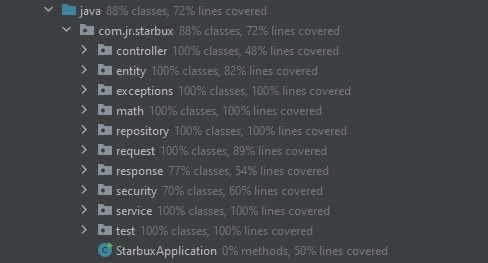
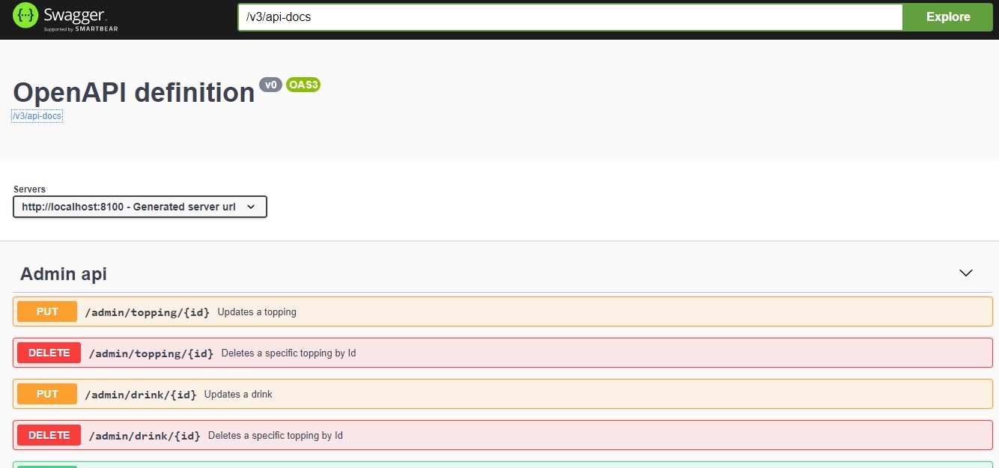

# starbux

First of all, thank you for this opportunity.

I'm looking forward to hear your feedback. 

### Getting started

Run docker compose file located [here](https://github.com/jeremiasrg/starbux/blob/main/docker-compose.yml).

```docker
docker-compose up -d
```

### Admin user to request jwt token.

```json
http://localhost:8100/user/authenticate

{
    "email": "admin@admin.com",
    "password": "@#$@#$AA"
}
```

### Swagger

```json
// HOST + PORT + /swagger-ui.html
http://localhost:8100/swagger-ui.html
```

### Open API

```json
// HOST + PORT + /v3/api-docs
http://localhost:8100/v3/api-docs
```

### Test coverage > 70% ✅
Information extracted by Intellij IDE


### Logging ✅

### No extra configuration should be needed to spin up the application. ✅

### Bonus points:

- Dockerized application ✅ Click [here](https://github.com/jeremiasrg/starbux/blob/main/docker-compose.yml)
- Cloud deployment (AWS, heroku etc.) 🚫
- Integration tests ✅ Click [here](https://github.com/jeremiasrg/starbux/tree/main/src/test/java/com/jr/starbux/controller/integration)
- API Documentation ✅




Please, let me know if you have any doubts.

Regards,